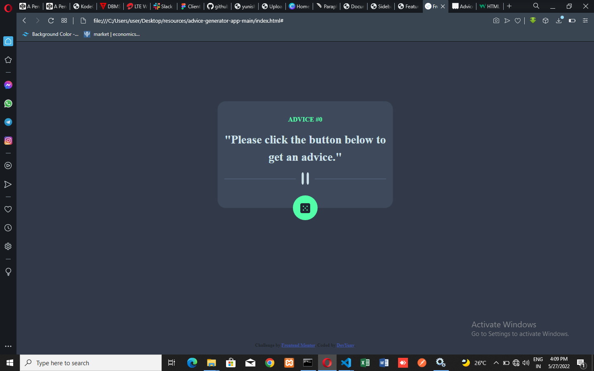

# Frontend Mentor - Advice generator app solution

This is a solution to the [Advice generator app challenge on Frontend Mentor](https://www.frontendmentor.io/challenges/advice-generator-app-QdUG-13db). Frontend Mentor challenges help you improve your coding skills by building realistic projects.

## Table of contents

- [Overview](#overview)
  - [The challenge](#the-challenge)
  - [Screenshot](#screenshot)
  - [Links](#links)
- [My process](#my-process)
  - [Built with](#built-with)
  - [What I learned](#what-i-learned)
  - [Continued development](#continued-development)
  - [Useful resources](#useful-resources)
- [Author](#author)
- [Acknowledgments](#acknowledgments)

## Overview

### The challenge

Users should be able to:

- View the optimal layout for the app depending on their device's screen size
- See hover states for all interactive elements on the page
- Generate a new piece of advice by clicking the dice icon

did i get it right? please feel free to comment.

### Screenshot



### Links

- Solution URL: [https://yunishello.github.io/adviceapp]

## My process

### Built with

- Semantic HTML5 markup
- CSS custom properties
- Flexbox
- CSS Grid
- Mobile-first workflow
- [Bootstrap 5](https://getbootstrap.com/docs/5.0/getting-started/introduction/)
- JavaScript

### What I learned

I found it interesting to finally know how to use this amazing css trick on how to position an element.

```css
.proud-of-this-css {
  position: absolute;
  top: 100%;
  left: 50%;
  -ms-transform: translate(-50%, -50%);
  transform: translate(-50%, -50%);
}
```

### Continued development

I will love to learn more on:

-How to design better layouts
-color selection for project
-best practices

### Useful resources

- [Color Picker](https://www.google.com/url?sa=t&rct=j&q=&esrc=s&source=web&cd=&cad=rja&uact=8&ved=2ahUKEwjSqMrG44D4AhXviP0HHVdqDpsQFnoECAUQAQ&url=https%3A%2F%2Fwww.w3schools.com%2Fcolors%2Fcolors_picker.asp&usg=AOvVaw1DM38l4l8ms47aSj9V3KA_) - This helped me in choosing reason. I really liked this pattern and will use it going forward.
- [Position An Element](https://www.google.com/url?sa=t&rct=j&q=&esrc=s&source=web&cd=&cad=rja&uact=8&ved=2ahUKEwiv18HO6oD4AhUbiv0HHSOXBv4QFnoECBgQAQ&url=https%3A%2F%2Fwww.w3schools.com%2Fcss%2Ftryit.asp%3Ffilename%3Dtrycss_align_transform&usg=AOvVaw3OrikF803H9vOR6d3EHWnn) - This helped me in achieving the positioning

## Author

- Website - Yunus Yusuf Oladimeji
- Frontend Mentor - [@Yunishello](https://www.frontendmentor.io/profile/Yunishello)
- Github - [@Yunishello](https://github.com/Yunishello)
